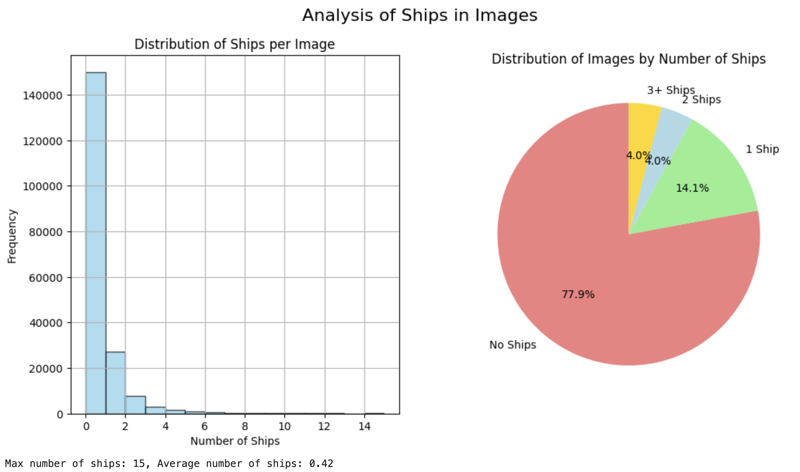
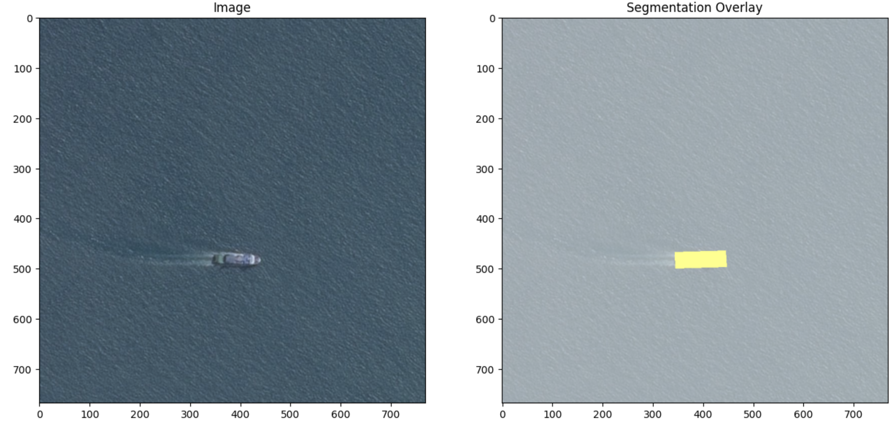
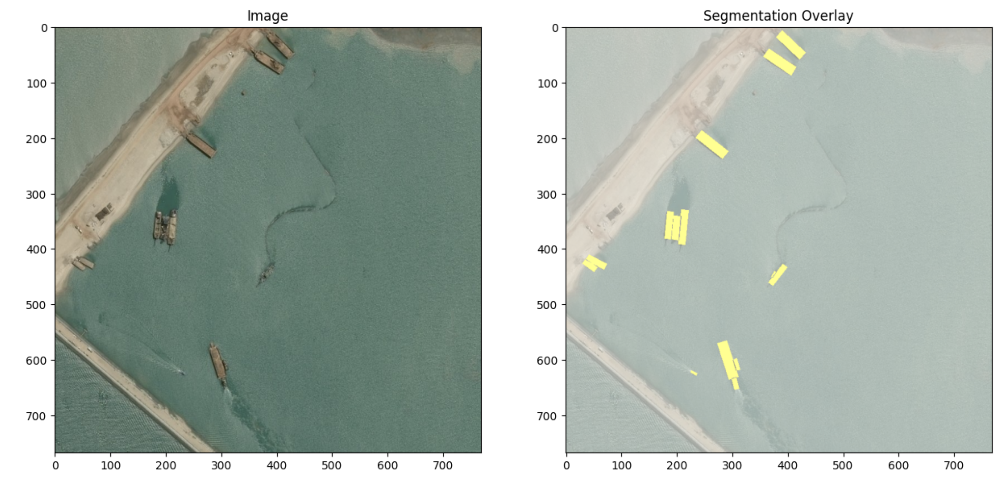
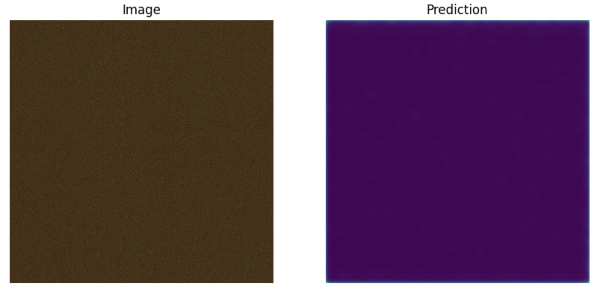
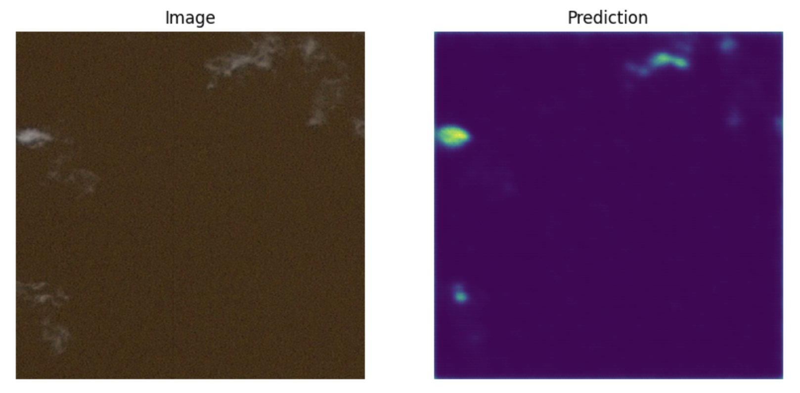
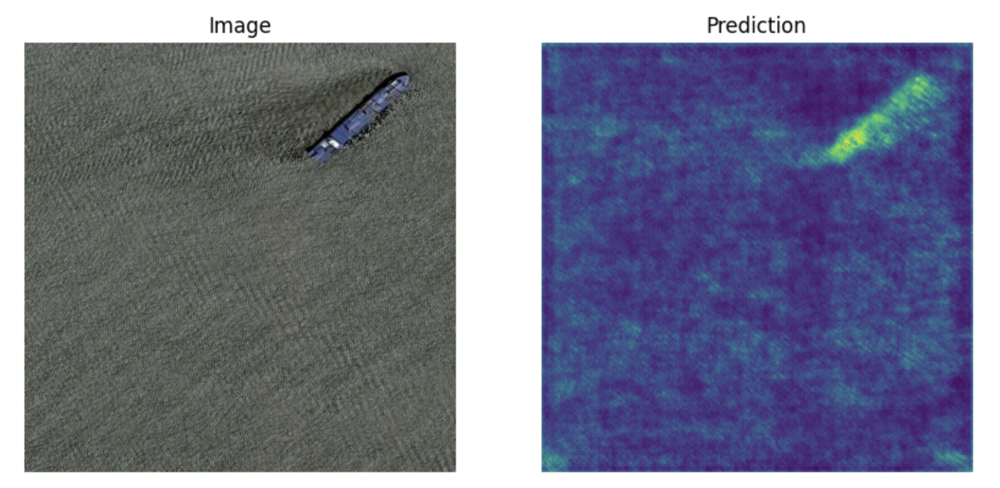
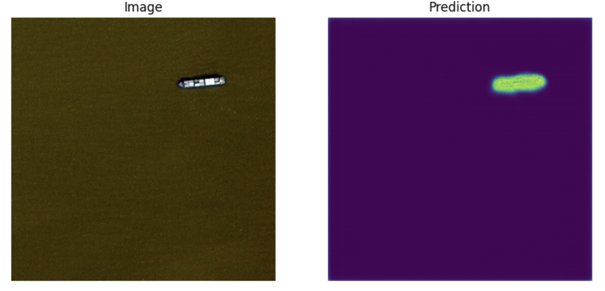
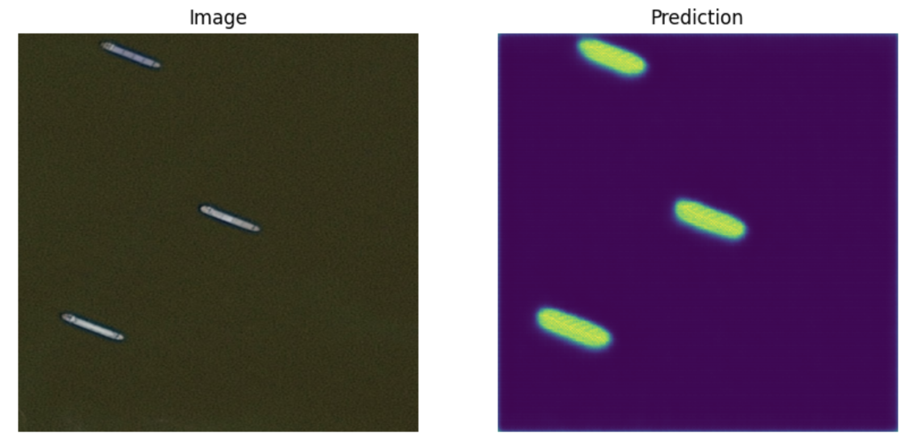

# Airbus Ship Detection

>### Task
> The goal of the test project is to build a semantic segmentation model. Prefered tools and notes: **tf.keras, U-Net architecture** for neural network, **dice score, python**. 

>**Results of work contain next:**
>* code for model training and model inference separated into different .py files;
>* readme.md file with complete description of solution;
>* requirements.txt with required python modules;
>* jupyter notebook with exploratory data analysis of the dataset;
>* any other things used during the working with task);

> * Project is easy to deploy for testing;

## About Dataset

The dataset consists of photos of ships taken from an aircraft. As evident from the **graph below**, the dataset is not balanced, as the majority of the photographs depict photos without any ships.



This visualization indicates that our dataset follows a distribution where images containing no ships are approximately three times more abundant than those with ships. As a takeaway for future endeavors, it suggests a strategy for training models using samples that predominantly feature ships, with only a small portion dedicated to images without ships. This approach aims to optimize the model's ability to effectively address the segmentation problem.

Loads an images and displays it along with the ship segmentations using encoded pixels from the file `train_ship_segmentations_v2.csv`.


>You can learn more about the dataset in the file `ipynbs/data_overview.ipynbs`.

## How to install
1. Clone repository into folder of your choice:
   ```
   git clone https://github.com/Daito6/airbus-ship-detection-project .
   ```
2. Create virtual environment:

   **Windows**   
   ```
   python -m venv venv
   ```

   **MacOS**
   ```
   python3 -m venv venv
   ```
3. Activate virtual environment:

   **Windows**
   ```
   .\venv\Scripts\activate
   ```
   
   **MacOS**
   ```
   source venv/bin/activate
   ```
4. Install all the needed packages
    ```
    pip install -r requirements.txt
    ```
5. Install the [dataset](https://www.kaggle.com/c/airbus-ship-detection/data).

6. Go into file `paths.py` and change `BASE_DIR` constant according to **full path** to your repository directory.
## Results
Example 1(pictures without ships): 

Example 2(pictures without ships with fog): 

Example 3(pictures with one ship): 

Example 4(pictures with one ship): 

Example 5(pictures with three ships): 

